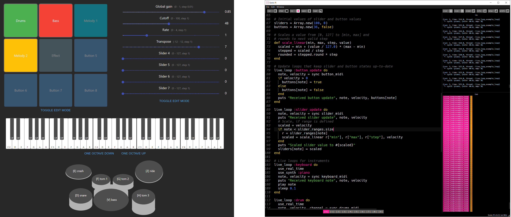
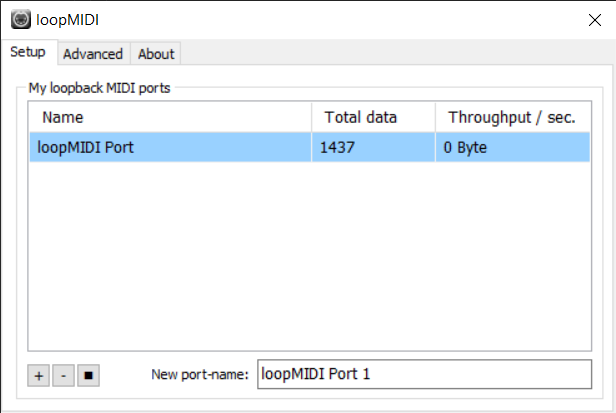

# sonic-pi-controller

1. [sonic-pi-controller](#sonic-pi-controller)
   1. [About](#about)
   2. [Setup](#setup)
   3. [Sonic Pi & loopMIDI](#sonic-pi--loopmidi)
   4. [Controller Frontend](#controller-frontend)
   5. [Usage](#usage)
      1. [Keyboard](#keyboard)
      2. [Drum kit](#drum-kit)
      3. [Buttons Pad](#buttons-pad)
      4. [Sliders](#sliders)
   6. [Troubleshooting](#troubleshooting)



## About

The _Sonic Pi Controller_ web app is an additional tool for Sonic Pi to control sequences code.
This provides a more visual and user friendly way to use Sonic Pi.

The digital instrument interfaces include:

- Button pad to toggle (turn on/off) functionality such as loop or play alternative notes
- Sliders for quickly changing numerical parameters, such as those of effects
- Instruments for improvisation (keyboard and drums)

## Setup

You will need:

- [Sonic Pi](https://sonic-pi.net/)
- [loopMIDI](http://www.tobias-erichsen.de/software/loopmidi.html) or similar MIDI loopback software (MacOS has something built-in)
- [A browser that supports the Web MIDI API](https://caniuse.com/midi) (Chrome, Edge, and Opera work)
- [Node.js](https://nodejs.org/en/) (only for self-hosting the frontend)

## Sonic Pi & loopMIDI

1. Open the file `controller-boilerplate.rb ` in Sonic Pi.
2. Change the path to the drum-samples folder.
    ``` ruby
    samples = "C:\\path\\to\\drum-samples\\"
    ```
    You can simply drag & prop the folder into Sonic Pi if you are not sure how to write the path.
3. Open loopMIDI and add a new MIDI Port (+), it should look like this:

   

4. In Sonic Pi on the top right, open "prefs > I/O".
5. The MIDI-ports list should contain the loopMIDI Port:

   

6. In the configuration part of `controller-boilerplate.rb` you will find the declaration for the MIDI port:
    ```ruby
    midi_port = "/midi:loopmidi_port_0"
    ```
    Make sure the value of `midi_port` is the same MIDI-port in the I/O section of Sonic Pi.
    You can also try using the frontend and look at incoming MIDI messages in Sonic Pi's 'Cues' panel to see the MIDI port's name.

## Controller Frontend

If you want to set up your own hosted version of the frontend, proceed as follows:

1. Install [Node.js](https://nodejs.org/en/)
2. Open your terminal in the subfolder `sonicpi-controller` and run `npm install` to install packages
3. After the install run `npm start` to start the web app. Make sure to use one of the browsers mentioned above.
4. Back in Sonic Pi, klick on the `run` button at the top or press `Alt + R`
5. Yyou can now control Sonic Pi over the web app. Head over to the [troubleshooting](#troubleshooting) section if there are issues.

## Usage

The web app has the following features:

### Keyboard

Click or touch the keys you want to play with a mouse or touchscreen. If you want to change the way the keyboard sounds, you can change the `use_synth :piano` command in Sonic Pi to one of the many other available synths. You can find this command in the keyboard live loop.

You can also change the octaves of the keyboard by clicking on the corresponding buttons below the keyboard. Not every note can be played or sounds good on every synthesizer.

### Drum kit

Similar to the keyboard, you can just click / touch on a drum to play it. In addition, you can play the drums by pressing the corresponding keys on your keyboard. You can also change the way the drums sound by using different samples in Sonic Pi.

### Buttons Pad

You first need to configure the buttons to play something.
Here are some examples:
```ruby
live_loop :buttons do
  note, velocity = sync button_midi
  if buttons[0]
    live_loop :button0loop do
      sample :loop_breakbeat, amp:5
      sleep sample_duration :loop_breakbeat
      stop if !buttons[0]
    end
  end
  if buttons[1]
    live_loop :button1loop do
      use_synth :beep
      play (ring :c, :r, :e, :r, :g, :r, :b, :r, :c5, :r, :b, :r, :g, :r, :e, :r).tick
      sleep 0.125
      stop if !buttons[1]
    end
  end
end
```

After configuration, press a button to trigger a sample to be played.
To give yourself a better overview, you can change the button's colors and labels after activating the edit mode.
You can also add more buttons or reduce them.

### Sliders

You can add or remove sliders in the web app.
To use them, set a fitting range and step size for the numerical values that you want to change, both in the frontend and in the Sonic Pi code:
```ruby
slider_ranges = [
  Hash["min" => 0, "max" => 10, "step" => 1], # slider 0
  Hash["min" => 0, "max" => 5, "step" => 0.1], # slider 1
  Hash["min" => 0, "max" => 50, "step" => 0.5], # slider 2
  Hash["min" => 0, "max" => 27, "step" => 1], # slider 3
]
```

In the boilerplate code, you can set the values for the sliders to be inizialized with
```ruby
sliders = [0, 0, 0, 0, 0, 0, 0]
```

Note that we added some sliders as a default, you can add or remove them as you like (not more than 100).
There are many ways to use the sliders, here are some examples:
```ruby
live_loop :sample do
   sample :loop_breakbeat, amp: sliders[0] rate:sliders[3]
   sleep sample_duration :loop_breakbeat
end

live_loop :ringmelody do
      use_synth :beep
      use_transpose sliders[1]
      play (ring :c, :r, :e, :r, :g, :r).tick
      sleep 0.125
end
```

## Troubleshooting

- If anything does not work, try stopping Sonic Pi and then hitting `run` again.

- If this does not help, try closing and starting Sonic Pi again. Don't forget to save your code before you do that, though.

- You might be confused when you trigger a sample through a button, trigger it again to stop, but it does not stop playing immediately. This is because Sonic Pi schedules ahead. If you make changes, like registering a new event to play (or stop), Sonic Pi will do that a bar later.

- Playing the drum kit feels like it has a bit of a lag. If you don't want to get bothered by this, you can code a drum sample and trigger it in the button pad, this will avoid any lag.

- When you make changes to a sample over the sliders, it sometimes does not change it right away. A fix for this is toggling a button that controls the sample off and on again to get the changes to play in the next bar. You don't always have to do this, only when you change the slider's value and the sample still sounds the same. Most of the times it adapts the slider change right away.

- If you cannot figure an issue out on your own, you can raise an [issue on GitHub](https://github.com/visvar/sonic-pi-controller/issues).
